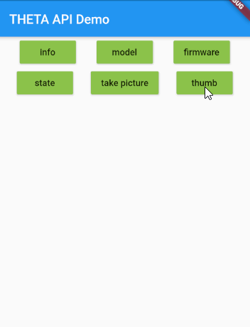

# THETA WebAPI Flutter Test



Demonstration of THETA WebAPI Tester.

[theta WebAPI package](https://github.com/theta360developers/webapi/tree/master/packages/theta)

RICOH THETA camera models V, SC2, SC2B, Z1 using RICOH API v2.1.

## Example implementation

```dart
  void _info() async {
    _displayResponse(await Camera.info);
  }

...
MaterialButton(
    onPressed: _info,
    child: Text('info'),
    color: Colors.lightGreen,
),
```

## Camera state and status

The thumb button does not check for camera status before attempting to display
the thumbnail.  If you take a picture, you must manually wait 8 seconds for non-HDR
or 10 seconds for hdr shots before the camera is ready to display the thumbnail.

When you write you actual app, refer to the [command line webapi repository](https://github.com/theta360developers/webapi) for examples
on getting camera status after you take a picture.

There is more information on getting the status in this [library file](https://github.com/codetricity/theta/blob/main/lib/src/protocols.dart).  You need to pass the id to `/osc/commands/status`.  You get
the id from the response of `takePicture`.
